# Otter
Otter is a real-time social media app utilizing Google Firestore and Google Firebase.

## Features
* Login
* Sign up 
* Add a post
* Like or share another user's post
* View posts from users you follow
* View posts from all Otter users
* View profiles of other users
  * follow/unfollow users
  * view their posts, shared posts, and favorited posts
* Search for users by name or username
* Message users you follow
  * Send texts or photos
  * Save photos from chat
* Edit user profile
* Update password or email
* Delete account

### Login 
  * User authentication with Firebase
  * Forgot password
    * Reset password with Firebase
  * Sign in persistance
  
  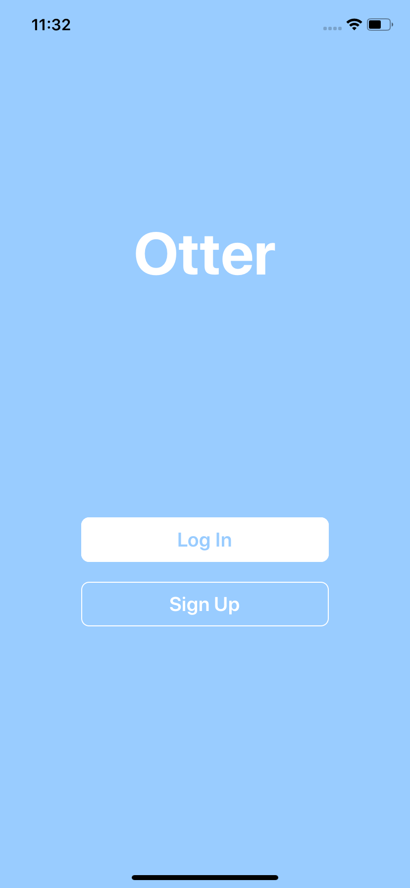   
  
### Sign Up
  * Email validation
  * Username validation
    * Usernames must be unique
  * Strong password validation
    * Valid passwords have at least length 8, 1 letter, and 1 special character
    
   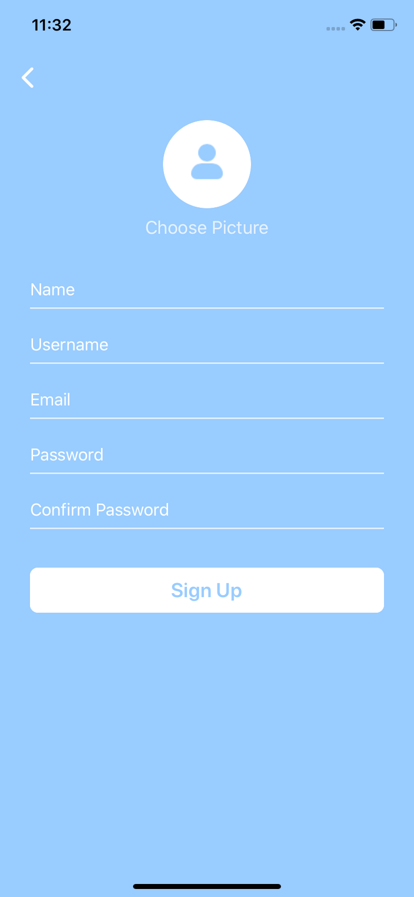
 
### Home
  * Posts from users the logged in user follows
  * New post alert if the user is scrolled down and a post was added
  
   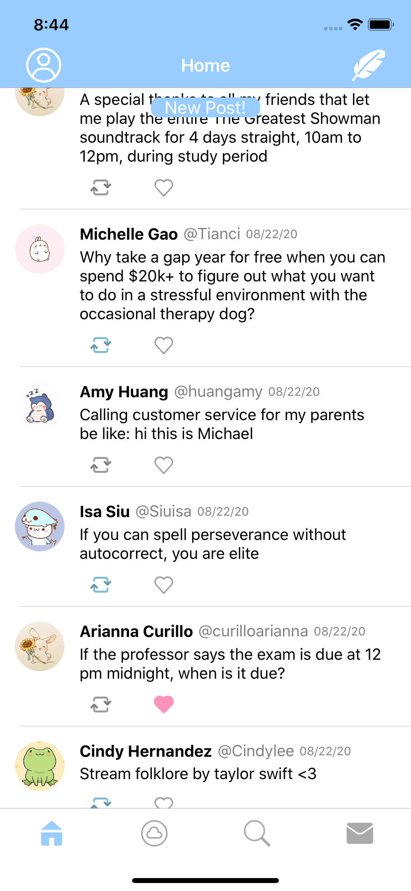
 
### Posts
  * Can be shared or favorited
  * Have time/date stamps
  * Profile image can be tapped to be taken to the poster's profile page
  * Post length imited to 150 characters
  
    
  
### Menu

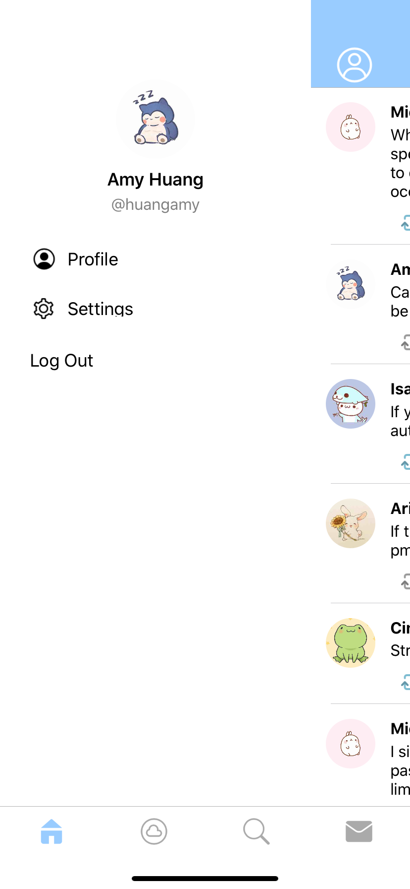 

  * User profile
    * Edit profile
      * Change profile photo
      * Change header photo
      * Update name
      * Update username
      * Update bio
   
  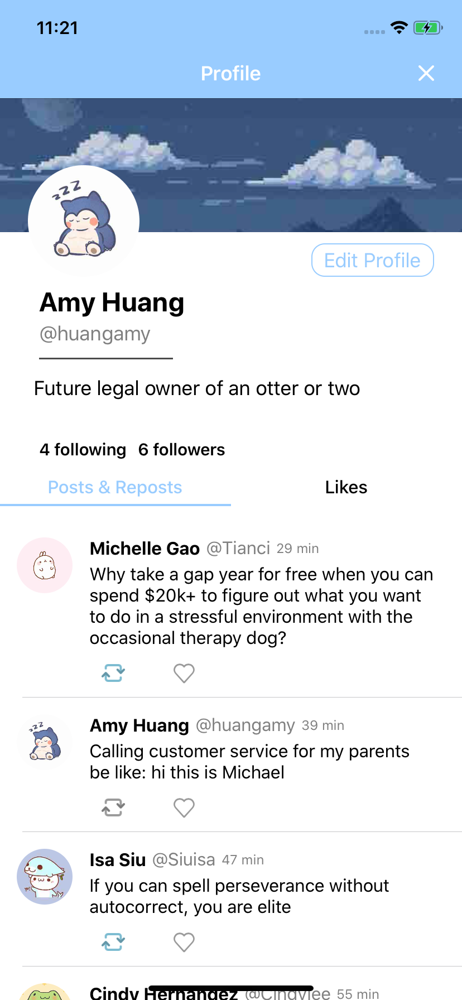 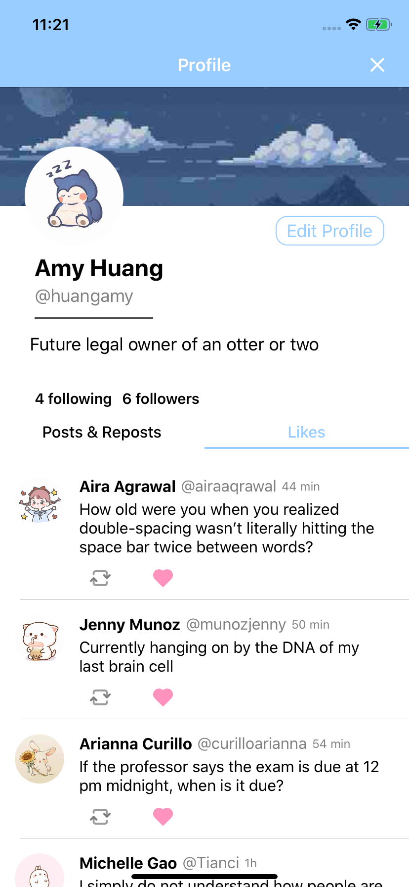 
       
  * Settings
    * Update password
    * Update email
    * Delete account
    
     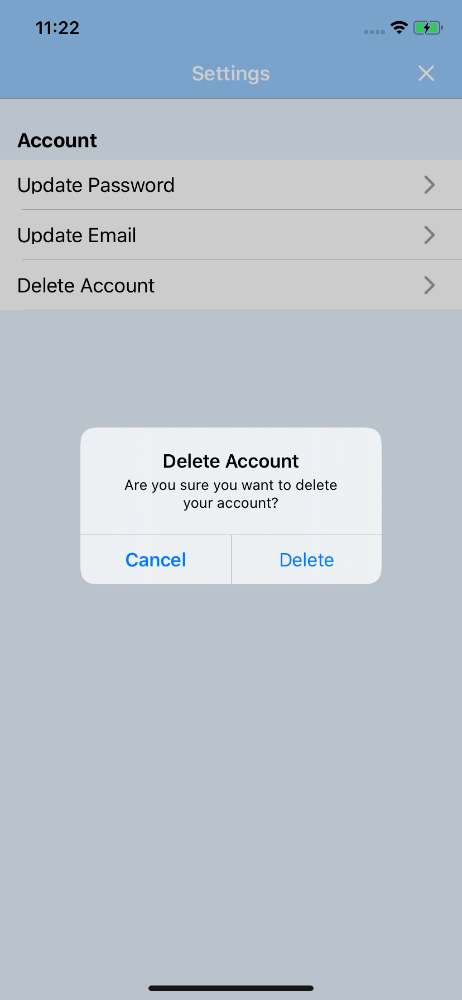
  
### Otter Global
  * Posts from all Otter users
  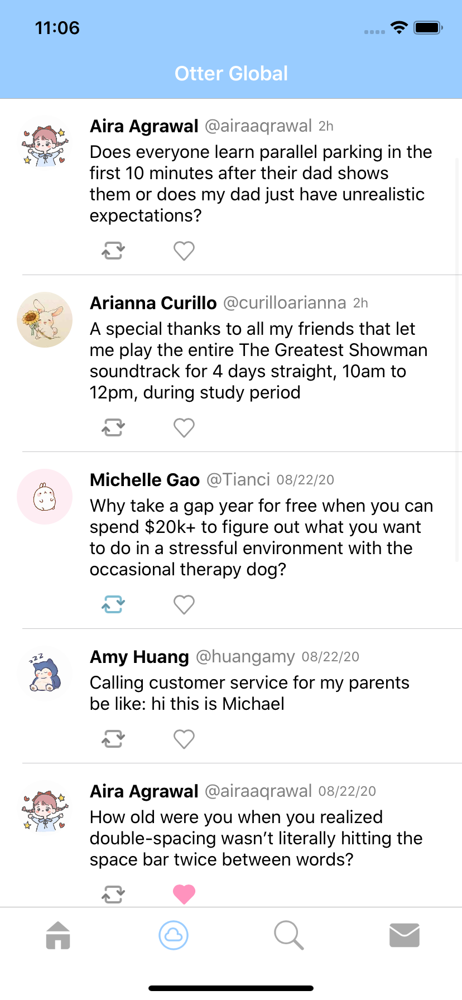 
  
### Other User
  * Can follow or unfollow other users
  * Can view posts, shared posts, and favorited posts of other users
  
  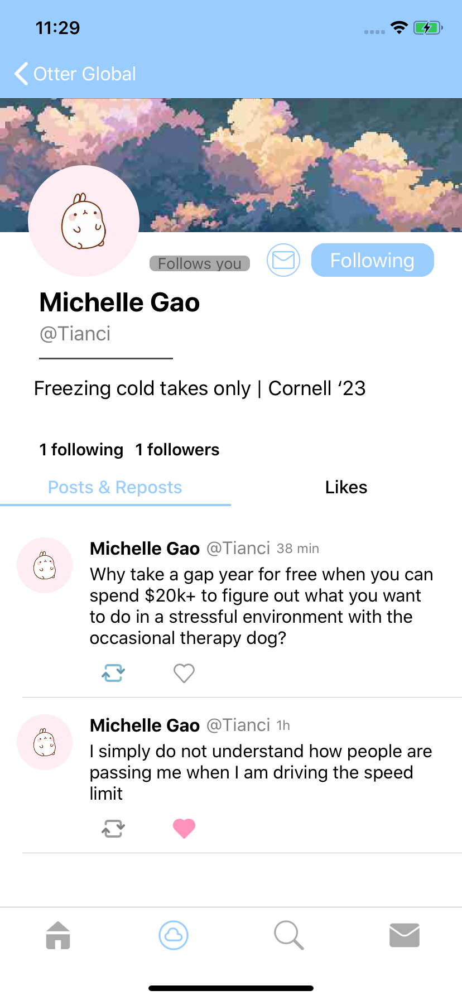
   
### Search 
  * Search for other Otter users by name or username
  
  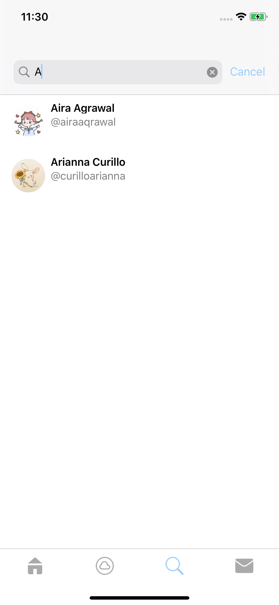 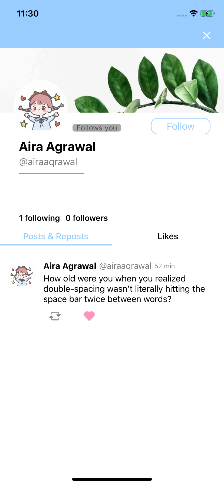 
  
### Messages
  * Add chat
    * Message followed users
    
  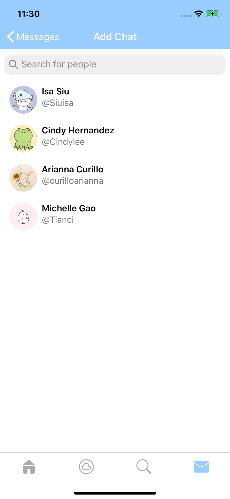
  
  * Chat
    * Send text messages or images
    * Save images
      * Click the save image icon
      * Hold on the image until the popup appears
    * Click the info icon to see the profile of the user you are chatting with
  
  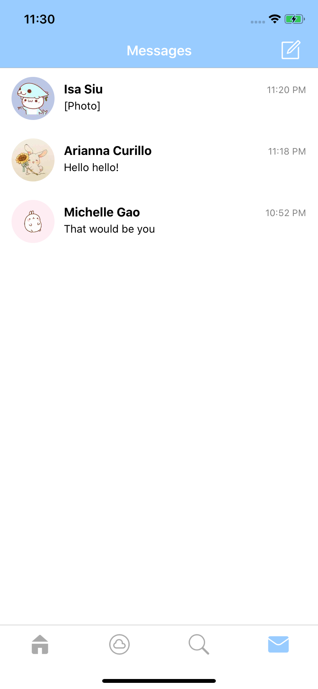 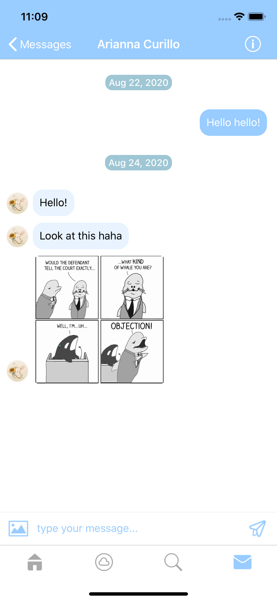   
   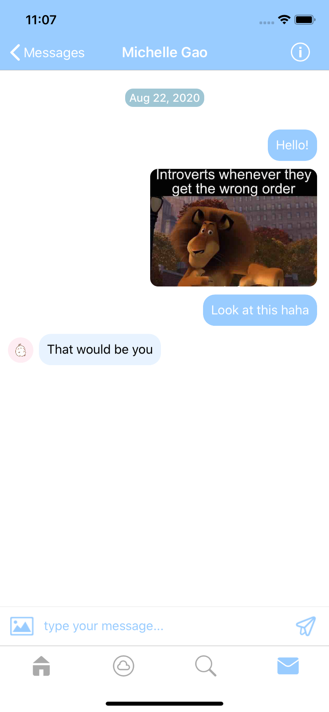  
  

